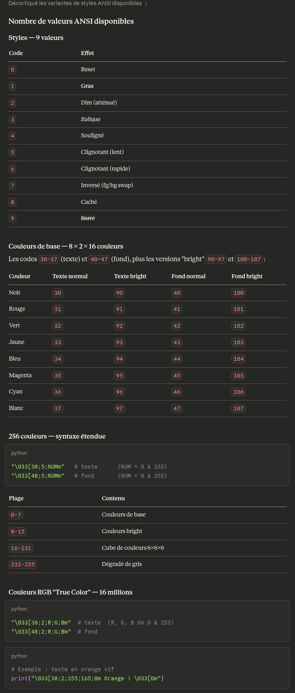

*This project has been created as part of the 42 curriculum by aslimani and adamez-f*


## Default maze_config.txt
```
#WIDTH: Maze width (number of cells)
#HEIGHT: Maze height
#ENTRY: Entry coordinates (x,y)
#EXIT: Exit coordinates (x,y)
#OUTPUT_FILE: Output filename
#PERFECT: Is the maze perfect?
WIDTH=20
HEIGHT=15
ENTRY=0,0
EXIT=19,14
OUTPUT_FILE=maze.txt
PERFECT=True
```


## Sources :
[How to change the output color](https://stackoverflow.com/questions/5947742/how-to-change-the-output-color-of-echo-in-linux)

text coloring: 
début de séquence  : \033[
fin de séquence    : \033[0m 	(le 0 remet tous les settings à jour
milieu de séquence : 1;32;40m 	
	- 1er élément  : style d'écriture (0-9)
	- 2ème élément : text color (30-47 et 90-97(Bright))
	- 3ème élément : background color (40-47 et 100-107(Birght))

exemple : print("\033[1;30;47mBright Green\033[0m")
